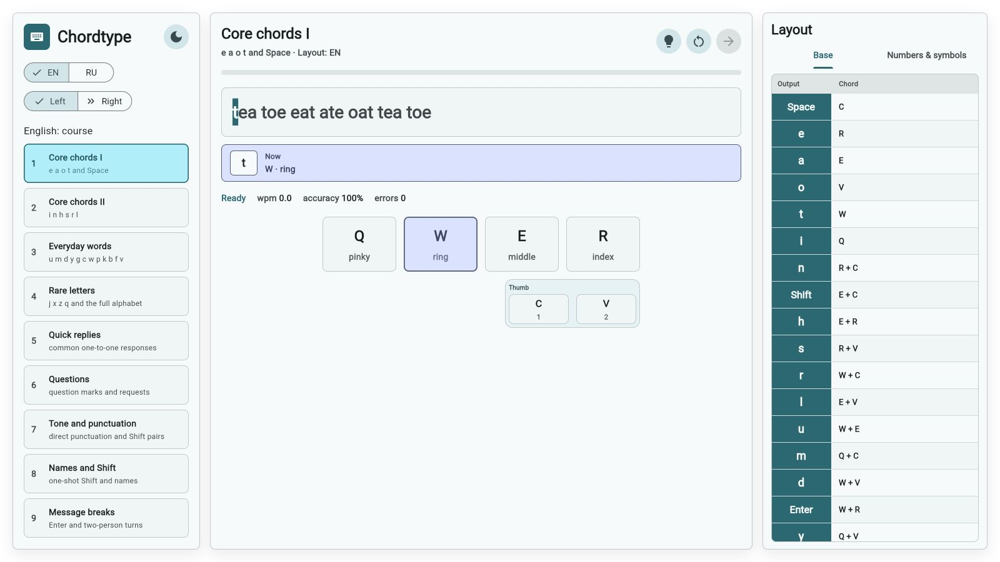
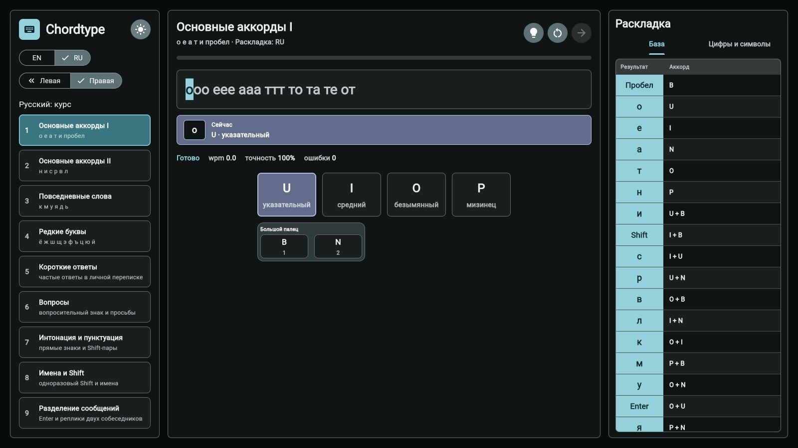

# Chordtype

Research prototype of a one-hand chorded keyboard for English and Russian communication.

[Layout and frequency analysis](LAYOUT.md)


## Project Overview

Chordtype primarily evaluates the feasibility and usability of implementing a chorded keyboard on a mobile device for one-handed communication. The current Flutter Web/PWA trainer is an experimental testbed, not the final mobile keyboard: it makes the layout, input model, learning curve, and ergonomic constraints observable before they are transferred to a mobile implementation.

The layout is optimized for short person-to-person messenger text. Exact EN/RU mappings, Shift punctuation pairs, the direct unified numbers-and-symbols layer, corpus sources, and the reproducible frequency-analysis procedure are maintained in [LAYOUT.md](LAYOUT.md).

Shift applies only to the base layouts. The numbers-and-symbols layer assigns one chord to every value and replaces an armed Shift instead of composing with it.

## Game Description

The trainer asks the user to enter lesson text by pressing and releasing chords on six physical keyboard keys. It provides:

- left-hand `QWER / CV` and right-hand `UIOP / BN` physical key modes;
- independent English and Russian courses and input layouts;
- 18 progressive lessons per language, from frequent chords to sustained,
  naturally capitalized messenger turns without speaker-name prefixes;
- an English course that stays in EN and a Russian course that introduces a
  bilingual exchange before handles and links;
- Shift for the base layouts, a direct unified numbers-and-symbols layer,
  Space, Backspace, Enter, and EN/RU controls;
- physical-key recognition that is independent of the operating-system layout;
- optional next-chord and finger hints with virtual-key highlighting;
- retained error highlighting and a persistent Backspace correction prompt;
- WPM, accuracy, error counts, and browser-local lesson statistics;
- responsive light and dark interfaces and a static PWA build.

The project has no backend, accounts, analytics, or cloud synchronization.

## Screenshots



*English course · light theme · left hand · QWER / CV*



*Russian course · dark theme · right hand · UIOP / BN*

## Setup Instructions

Prerequisites:

- Flutter SDK with Dart `>=3.3.0 <4.0.0`.
- A Flutter Web-supported browser such as Chrome.

From the repository root, install dependencies:

```bash
flutter pub get
```

## Run Instructions

Run in Chrome:

```bash
flutter run -d chrome
```

If Chrome is unavailable, use Flutter's web-server device:

```bash
flutter run -d web-server --web-hostname 127.0.0.1 --web-port 8080
```

Then open `http://127.0.0.1:8080`.

## Documentation

- [LAYOUT.md](LAYOUT.md) — authoritative layout tables, ergonomic rules, corpus data, and analysis reproduction.
